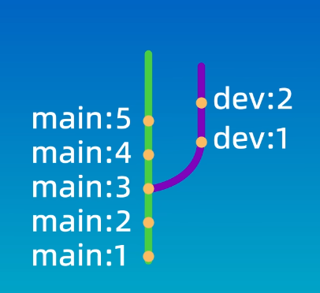

#### 什么是Git？

git是一个免费开源的分布式版本控制系统，它使用一种特殊的叫做仓库（Repository）的数据库来记录文件的变化。

仓库中的每个文件都有一个完整的版本的历史记录，可以看到谁在什么时间修改了哪些文件的哪些内容，在需要的时候也可以将文件恢复到之前的某一个版本。


##### 分布式管理系统

在每个人的电脑上都有一个完整的版本库，可以在本地进行修改而不需考虑网络问题，当我们需要将我们的修改内容分享给其他人时，只需要将仓库互相同步一下就可以了。


#### 安装Git

FOR WINDOWS：

进入官网下载对应的版本：

> [Git (git-scm.com)](https://git-scm.com/)

安装完成后在cmd中输入：

```BASH
git -v
```

如果显示出版本信息即代表安装成功。

##### 配置posh-git

为了更好的优化我们的bash，得到命令高亮，git显示等功能，我们在windows进行posh-git的配置。

我们使用Windows的终端，也就是Windows PowerShell来进行配置（不是cmd！！！）。

在 Windows 上，脚本执行策略必须设置为 RemoteSigned 或 Unlimited，需要以管理员身份在powershell中执行以下语句:

```bash
Set-ExecutionPolicy RemoteSigned -Scope CurrentUser -Confirm
```

安装posh-git:

```bash
Install-Module PowershellGet -Force
##A completely new installation
PowerShellGet\Install-Module posh-git -Scope CurrentUser -Force
```

更新:

```bash
PowerShellGet\Update-Module posh-git
```

在powershell终端对`$PROFILE`文件进行编辑：

```bash
notepad $PROFILE
```

在文件中追加以下内容：

```bash
Import-Module posh-git
```

其他可选项:

```bash
##To enable posh-git to be available in just the current host, execute:
Add-PoshGitToProfile

##To enable posh-git to be available in all your PowerShell hosts-console, ISE, etc, execute:
Add-PoshGitToProfile -AllHosts

##To enable posh-git to be available for all users on the system, execute:
Add-PoshGitToProfile -AllUsers -AllHosts

##To enable posh-git to be available for all users but only for the current host
Add-PoshGitToProfile -AllUsers

```

##### Git命令


##### 配置Git

第一步：使用 git config 命令 配置用户名和邮箱。

```bash
git config --global user.name "用户名" #如果用户名之间不存在空格，就可以省略双引号
```

```bash
git config --global user.email 邮箱地址
```

> 省略（Local）：本地配置，只对本地仓库有效
>
> --global：全局配置，所有仓库生效
>
> --system：系统配置，对所有用户生效 （一般不会使用）

可以使用以下的命令来保存用户名和密码，防止每次输入。

```bash
git config --global credential.helper store
```

可以使用以下的命令来查看Git的配置信息

```bash
git config --global --list
```


#### 新建仓库

仓库相当于一个目录，这个目录里所有的文件都可以被Git管理起来，每个文件的修改，删除，添加等操作，Git都能跟踪到，以便任何时候都可以追踪历史或还原到之前的某一个版本。

创建仓库非常简单，只需要把一个目录变成Git可以管理的仓库就可以了。

###### 方式一：

在自己电脑本地直接创建一个仓库。

```bash
git init
```

1. 首先找到一个合适的位置创建一个空目录
2. 然后在shell输入

```bash
git init
#后面还能指定一个目录名称，如果制定了，就会在当前目录下创建一个新的目录作为git仓库
```


master是这个分支的名字，表示当前这个目录已经是一个被Git管理的仓库。

.git这个目录存放了Git仓库的所有数据，使用以下命令来显示（.git是隐藏的目录）：

```bash
Get-ChildItem -Force
```

如果将这个目录删除，相应的仓库也会被删除掉。

###### 方式二：

从远程服务器克隆一个已经存在的仓库。

```bash
git clone 仓库地址
```

#### Git的工作区域和文件状态

Git的本地数据管理分为三个区域：

- 工作区 Working Directory ：自己电脑上的目录
- 暂存区 Staging Area/Index：临时储存区域，用于保存即将提交到Git仓库的修改内容。
- 本地仓库 Local Repository： Git存储代码和版本信息的主要位置。


Git中存在四种状态：

- 未跟踪 Untrack：新创建的，还未被Git管理起来的文件。
- 未修改 Unmodified：已经被Git管理起来，但是文件的内容没有发生变化的。
- 已修改 Modified：已经修改了文件，但是还没有添加到暂存区里的文件。
- 已暂存 Staged：修改后，并且已经添加到了暂存区域的文件。


#### 添加和提交文件

##### 查看仓库的状态

```bash
git status
git status -s #表示查看状态这个命令的简略模式
```

可以用来查看当前仓库的状态，可以查看当前仓库处于哪个分支，有哪些文件，以及这些文件当前处在怎样的一个状态。

##### 添加到暂存区

```bash
git add [路径]
#可以在后面直接写文件名
#可以使用通配符 eg:*.txt 代表所有以.txt结尾的文件
#.代表当前目录中所有文件
```

##### 提交

```bash
git commit -m "提交信息"
#只会提交在暂存区里的文件，而不会提交工作区里的其他文件
#如果不指定-m,那么Git会进入一个交互式的页面，默认使用vim来编辑提交信息。
```

##### 查看提交记录

```bash
git log
git log --oneline #用于查看简单的提交记录
```

记录包含：

- 一个唯一的提交ID
- 提交的作者
- 提交的邮箱
- 提交的时间
- 提交的注释信息


#### 使用 git reset 回退版本

reset命令用于回退版本，可以退回到之前的某一个提交的状态。

##### git reset的三种模式

```bash
git reset --soft 要回退的版本ID
#soft参数表示回退到某一个版本，并且保留工作区和暂存区的所有修改内容
```

```bash
git reset --hard 要回退的版本ID
#hard的参数表示回退到某一个版本，并且丢弃掉工作区和暂存区的所有修改内容
```

```bash
git reset --mixed 要回退的版本ID
#mixed这个参数就是介于soft和hard这两个参数之间，它表示回退到某一个版本，并且只保留工作区的修改内容,而丢弃暂存区的修改内容
```

**mixed是reset命令的默认参数。**


当我们连续提交了多个版本，但是又觉得这些提交没有太大意义，可以合并成一个版本时，就可以通过 --soft 和 --mixed  这两个参数来进行回退之后再重新进行提交。

而 hard 参数的使用场景，则是你真的要放弃目前本地所有修改内容的时候。谨慎使用！

##### 回溯git操作

Git中的所有操作都是可以回溯的。

```bash
git reflog
```

使用git reflog命令来查看我们操作的历史记录，然后找到误操作之前的版本号，使用 get reset 回溯即可。

#### 使用 git diff 查看差异

git diff可以用于查看：

- 文件在工作区、暂存区、本地仓库之间的差异
- 文件在不同版本之间的差异
- 文件在不同分支之间的差异

```powershell
git diff
#git diff后面什么都不加，会默认比较工作区和暂存区之间的差异
```

##### git diff 显示的信息


- 第一行提示我们发生变更的文件
- 第二行Git会将文件的内容使用哈希算法生成一个40位的哈希值，这里只显示哈希值的前七位      后面的“100644”表示的是文件的权限
- 接下来就是修改的内容了，红色表示删除的内容，绿色表示添加的内容

##### 比较工作区和仓库之间的差异

```powershell
git diff HEAD
#用于比较工作区和仓库之间的差异
```

##### 比较暂存区和仓库之间的差异

```powershell
git diff --cached
#用于比较暂存区和仓库之间的差异
```

##### 比较两个特定版本之间的差异

```powershell
git diff 01669be 9229d1c
#在后面填入通过git log --oneline 得到的两个版本号即可
#比较的是前一个相对于后一个文件改变了什么
```

```powershell
git diff 9229d1c HEAD 
#HEAD代表当前分支的最新提交
```

```powershell
git diff HEAD~ HEAD 
#HEAD代表当前分支的最新提交
#HEAD~表示最新提交的上个版本
#HEAD~2 表示最新提交的前两个版本
```

```powershell
git diff <filr_name> HEAD~ HEAD 
#只用于比较这个文件在两个版本之间的差异
```

##### 比较两个特定分支之间的差异

```powershell
git diff <branch> <branch>
```

#### 使用git rm删除文件

```powershell
git ls-files
#用于查看暂存区中的内容
```

windows方法：

```powershell
Remove-Item PATH
#删除文件
git add .
#现在工作区删除文件，然后再更新暂存区再提交
```

Git方法：

```powershell
git rm <file_name>
#git把这个文件从工作区和暂存区同时删除掉了
```

```powershell
git rm --cached<file>
#把文件从暂存区删除，但保留在当前工作区里
```

```powershell
git rm -r*
#递归删除某个目录下的所有子目录和文件
```

**删除之后一定要记得提交，否则删除的文件再版本库中还是存在的！！！**

#### 使用gitignore忽略文件

gitignore这个文件可以让我们忽略掉一些不应该被加入到版本库中的文件。

应该忽略的文件：

- 系统或者软件自动生成的文件
- 编译产生的中间文件和结果文件
- 运行时生成的日志文件、缓存文件、临时文件
- 涉及身份、密码、口令、密钥等敏感信息文件

**这个文件需要自己进行创建**

```powershell
.gitignore
```

我们在这个文件中写入想要忽略的文件，这个文件即不会被仓库系统管理。

```powershell
#我们也可以使用*.log之类的通配符来匹配所有以log结尾的文件
#使用 <文件夹名>/ 的形式来正确的忽略文件夹
```

**已经加入到仓库的文件将不会受到影响。**

空文件夹将不会被纳入到版本控制。

> 忽略文件的匹配规则
>
> [Git - gitignore Documentation (git-scm.com)](https://git-scm.com/docs/gitignore/zh_HANS-CN)

> 常用语言的忽略文件的模板
>
> [github/gitignore: A collection of useful .gitignore templates](https://github.com/github/gitignore)

#### 使用GitHub来管理代码

##### 如何将本地的仓库和远程的仓库关联起来

1.如果本地没有仓库的话，可以先创建一个仓库，然后通过以下的命令将本地仓库和这个远程仓库关联起来。

```powershell
echo "# demo" >> README.md
git init
git add README.md
git commit -m "first commit"
git branch -M main
git remote add origin git@github.com:diduox/demo.git
git push -u origin main
```

2.如果我们本地已经有了一个仓库的话

```powershell
git remote add origin git@github.com:diduox/demo.git
git branch -M main
git push -u origin main
```

##### 远程仓库地址的两种方式

**HTTPS（已停用）**

HTTPS开头的这种方式在我们把本地代码push到远程仓库的时候，需要验证用户名和密码。

**SSH（推荐）**

以git开头的SSH协议，这种方式在推送的时候不需要验证用户名和密码，但是需要在GitHub上添加SSH公钥的配置。

##### 配置SSH密钥

使用SSH方式必须要配置SSH的密钥。

1.首先进入到我们的用户根目录

```powershell
 cd C:\Users\桂物骑士
```

2.然后进入到 .ssh 目录（没有就自行创建一个）

```powershell
cd .ssh
```

3.然后使用ssh-key generate这个命令来生成我们的SSH密钥

```powershell
ssh-keygen -t -rsa -b 4096
#-t 指定协议位RSA
#-b 指定生成的大小为4096
```

4.回车之后，shell提示我们需要输入密钥的文件名称，如果是第一次使用这个命令的话，直接回车即可，其会在目录下生成一个id_rsa的密钥文件。

如果之前已经配置过SSH密钥的话，不要直接回车，否则会覆盖掉我们之前的密钥文件，且此操作不可逆！！！

所有我们要输入一个新的文件名，然后回车。

5.之后提示我们设置密码，如果不想设置密码，直接回车即可。

以上的操作会生成两个新的密钥文件`id_rsa`和`id_rsa.pub`

没有任何扩展名的就是私钥文件（不要泄露），而以`.pub`结尾的文件就是公钥文件。

我们需要打开打开公钥文件，并复制里面的内容，在`GitHub`的`Settings`里，进行SSH密钥的配置

##### config文件

如果不是第一次创建密钥，我们还需要在.ssh下创建一个config文件，并添加以下内容到文件中。这个命令的意思是，当访问GitHub的时候，指定使用一个密钥。

```
# github
Host github.com
HostName github.com
PreferredAuthentications publickey
IdentityFile ~/.ssh/<指定密钥>
```

> 河北经贸限定 BUG ：Connection timed out
>
> 出现链接超时请换成热点，不要使用校园网即可。

使用git clone命令将远程仓库配置到本地。

```powershell
git clone git@github.com:diduox/demo.git
```

##### 同步本地仓库与远程仓库

```powershell
git pull
#把本地仓库的修改推送给远程仓库
git push
#把远程仓库的修改拉取到本地仓库
```


#### 关联本地仓库和远程仓库

将本地仓库与在GitHub上创建的远程仓库关联起来。

```powershell
git remote add origin git@github.com:diduox/demo.git #添加一个远程仓库
git branch -M main #指定分支的名称为main
git push -u origin main:main #把本地的main分支和远程的origin仓库的main分支关联起来
```

查看当前仓库所对应的远程仓库的别名和地址

```powershell
git remote -v
```

#### GUI工具

> [GitKraken Desktop | Free Git GUI + Terminal | Mac, Windows, Linux](https://www.gitkraken.com/git-client)

这个工具的终端支持Linux命令。

#### 分支

分支可以看作代码库中的不同版本，可以独立存在，并且有自己的提交记录。


##### 分支的使用场景

分支非常适合团队协作和开发管理。

多个开发人员可以在自己的分支上进行开发工作，最后再合并到主线代码库中。

也可以在一个分支上进行新功能的开发，或者建立一个问题修复的分支来处理一些bug和缺陷，这样就可以让主线代码仓库处于一个随时可用的比较稳定的状态，而不会影响到其他功能的开发和测试。

##### 分支的演示

为了更好的演示分支的变化，仓库中的文件名和提交记录我们都以最简单的方式命名。

使用`分支名+序号`来命名文件，使用`分支名+冒号`来编写提交记录。


使用GUI界面来打开仓库，方便看到每次执行命令之后的变化。

```shell
#创建main中的文件
echo main1 > main1.txt
git add .
git commit -m "main:1"
echo main2 > main2.txt
git add .
git commit -m "main:2"
echo main3 > main3.txt
git add .
git commit -m "main:3"
#切换到dev分支
git branch dev
git switch dev
#创建dev的文件
echo dev1 > dev1.txt
git add .
git commit -m "dev:1"
echo dev2 > dev2.txt
git add .
git commit -m "dev:2"
#增加main分支的提交
git switch master
echo main4 > main4.txt
git add .
git commit -m "main:4"
echo main5 > main5.txt
git add .
git commit -m "main:5"
```

**查看当前仓库的所有分支**

```shell
git branch
```

**创建新的分支**

```shell
git branch <分支名>
```

**切换到不同的分支**

```shell
git checkout <分支名>
git switch <分支名>
```

##### git checkout

`git checkout` 不仅能切换分支，还能恢复文件。

如果分支名和文件名称相同的话，`git checkout`命令会默认切换分支，而不是恢复文件

##### 分支合并

在切换分支的时候，工作区的文件也会发生变化，切回到main分支之后，dev分支上的内容也都不见了。这是因为我们在dev分支上进行了修改，而这些修改还没有合并到main分支中。


可以看到main分支已经分叉了，可以很清楚的看到我们执行每一步提交操作时分支的变化。

假如测试完成没有问题之后，我们就需要把dev功能的分支合并到主线代码中。

**合并当前分支**

```shell
git merge <将要被合并的分支>
#当前所在的分支就是合并后的目标分支
```

> 使用此命令合并分支时，系统会为我们默认产生一次提交。
>
> 但是如果你的shell并没有安装vi/vim，那么则需要手动提交。

##### 命令行查看分支图

```shell
git log --graph --oneline --decora
```


分支被合并后也不会消失，除非我们手动删除它。

**删除分支**

```shell
git branch -d <分支名>
#-d 表示删除已经完成合并的分支
#-D 强制删除一个分支
```

#### 解决合并冲突

如果两个分支的修改内容没有重合的部分的话，Git会为我们自动完成合并。

但是如果两个分支修改了同一个文件的同一行代码，Git就不知道如何进行合并，这个时候就需要我们手动来解决冲突。

```shell
git commit -a -m "message"
#在提交命令中加入-a参数，就可以一个命令完成暂存和提交两个动作
#-a -m也可以省略成-am
```

当切换回main分支之后，工作区的文件内容也自动发生了变化，刚刚在其他分支添加的内容就会消失不见。因为在main分支中，我们还没有对这个文件进行修改，所以切换为main分支之后，Git自动为我们把工作区域的内容也恢复了。


**查看冲突文件的列表**

```shell
git status
```

**查看冲突的具体内容**

```shell
git diff
#需要vim插件来显示具体内容
```

我们需要手工编辑冲突文件，留下我们想要的内容之后，再重新进行提交。

提交之后会自动进行合并的过程。

**中止合并**

```shell
git merge --abort
```

#### Rebase和回退

#####  Merge

我们在main分支上进行合并操作。


##### Rebase

我们可以在任意分支上执行rebase操作。



如果我们在dev分支上执行rebase操作

```shell
git switch dev
git rebase main
```


如果在main分支上执行rebase操作

```shell
git switch main
git rebase dev
```


执行`rebase`之后，最后的结果都是一条直线，但是中间的顺序会稍微有些不同。

##### rebase机制

在`Git`中，每个分支都有一个指针，指向当前分支的最新提交记录。

在执行`rebase`操作时，Git会先找到当前分支和目标分支的共同祖先，再把当前分支上共同祖先到最新提交记录的所有提交，都移动到目标分支的的最新提交后面。

##### 恢复分支

```shell
git checkout -b <分支名> <提交ID>
#使用 git log 来查看提交ID
#git log --oneline --graph --decorate --all
```

##### Rebase和Merge的区别

Merge

- 优点：不会破坏原分支的提交记录，所有提交记录和合并历史都会保存下来，方便后续的查看和回滚。
- 缺点：会产生额外的提交记录和两条分支线的合并，会使得提交记录变得复杂。

Rebase

- 优点：不会新增额外的提交记录，形成线性历史，比较直观和干净。
- 缺点：会改变提交历史，因此避免在一个共享分支上进行rebase操作。

如果只是想把两个分支合并起来，而不关心提交历史，就可以使用`git merge`命令。


#### 分支管理和工作流模型

**GitFlow模型**

适用于团队技术水平适中，有一定的开发流程和规范的团队。

**GitHub Flow模型**

适用于技术水平比较高的团队或者开源项目。


##### 分支命名

推荐使用带有意义的描述性名称来命名分支

- 版本发布分支/Tag示例：v1.0.0
- 功能分支示例：feature-login-page
- 修复分支示例：hotfix-#issueid-desc

##### 分支管理

- 定期合并已经成功验证的分支，即使删除已经合并的分支
- 保持合适的分支数量
- 为分支设置合适的管理权限
