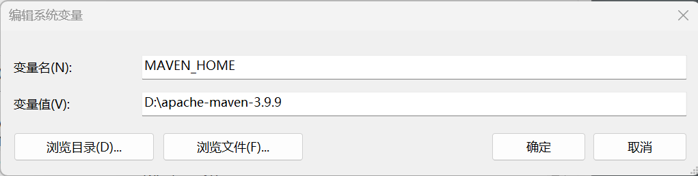
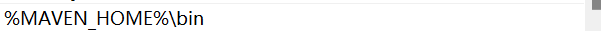

#### Maven简介

Maven是Apache软件基金会开源的一个自动化构建项目，主要是为了解决Java项目中最为常见的两个问题：**依赖管理**和**项目构建**。

##### 依赖管理

可以使用Maven帮我们管理程序所需要的依赖：

在一个`POM.xml`文件中，告诉Maven我们需要的依赖，Maven就可以自动地将这个jar包，以及它所依赖的所有其他的jar包，全部都下载并保存到项目中。

##### 构建管理

在Java项目中，我们需要把代码编译生成字节码文件。然后再把字节码文件打包成一个可执行的jar包或者war包.

Maven提供了一个标准的项目结构和构建流程。

##### pom.xml

Project Object Model 项目对象模型

`Maven`与`pom.xml`的关系相似于`make`与`makefile`的关系。

##### Maven仓库

在Maven中也有仓库的概念，仓库就是存放jar包的地方。

按照作用范围的不同，可以分为本地仓库，私服仓库，中央仓库。

- 本地仓库：位于电脑上的一个目录
- 私服仓库：一般是一个公司或者组织内部搭建的一个仓库，用来给内部的项目提供统一的依赖管理。
- 中央仓库：Maven官方维护的一个仓库，所有开源的jar包都可以在中央仓库里面找到。

#### Maven安装

1.选择合适的版本并下载解压到本地

> [Maven – Download Apache Maven](https://maven.apache.org/download.cgi)

> 注意：Maven和IDEA会出现版本兼容性问题
>
> 1.IDEA 2024 兼容maven 3.9.6及之前的所用版本
> 2.IDEA 2023 兼容maven 3.9.5及之前的所用版本
> 3.IDEA 2022 兼容maven 3.8.5及之前的所用版本
> 4.IDEA 2021 兼容maven 3.8.1及之前的所用版本
> 5.IDEA 2020 兼容Maven 3.6.3及之前所有版本
> 6.IDEA 2018 兼容Maven3.6.1及之前所有版  本

2.配置系统变量

先在系统变量中添加一个`MAVEN_HOME`的环境变量。



再在`PATH`环境变量里添加`MAVEN`中的`bin`目录



3.检查Maven是否安装成功。

```powershell
mvn -v
```

如果能看到版本信息，则说明安装成功。

##### Maven配置

> maven/conf/settings.xml

在注释里修改是无效的，将注释复制下来到文件的里面进行修改。

1.在 <localRepository></localRepository>标签中设定本地仓库的位置。

2.在<mirrors></mirrors>标签中设置镜像。

```xml
<!--用来配置国内镜像源来加速下载-->
<!--mirroeOf用来指定哪些仓库使用这些镜像，*代表所有仓库都使用这个镜像-->
<mirror>  
	<id>alimaven</id>  
	<name>aliyun maven</name>  
	<url>http://maven.aliyun.com/nexus/content/groups/public/</url>
	<mirrorOf>central</mirrorOf>          
</mirror>
```

3.在<profiles></profiles>标签中设置jdk版本，使用其他的版本直接更改版本号即可。

//这里待定，乱改反而跑不动了。

#### Maven使用

Maven官网提供的快速开始的说明文档。

> [Maven – Maven Getting Started Guide (apache.org)](https://maven.apache.org/guides/getting-started/index.html)

1.首先创建一个Maven项目，使用官方的快速开始模板来创建。

```powershell
#在windows下这几个配置信息都要加双引号，不然会报错
mvn archetype:generate -DgroupId="com.mycompany.app" -DartifactId="my-app" -DarchetypeArtifactId="maven-archetype-quickstart" -DarchetypeVersion="1.5" -DinteractiveMode="false"
```

-DgroupId：项目的组织Id，一般是一个项目或者组织的唯一标识。（通常方式是域名反写）

-DartifactId：项目的唯一标识，一般是项目工程的名字。

-DarchetypeVersion：模板Id,Maven为我们提供的各种不同类型的项目结构。

出现选择一直回车即可。

2.编译项目

```powershell
mvn complie
```

在此处可能会出现版本兼容问题，即maven-compiler-plugin和maven版本不兼容。

(IDEA版本-JDK版本-Maven版本-maven-compiler-plugin版本，这也不兼容，那也不兼容，怎么不去死呢，快死了得了。)

~~JAVA8F8FQ~~

**~~有ChatGPT帮忙看错误日志真是太好了~~**

