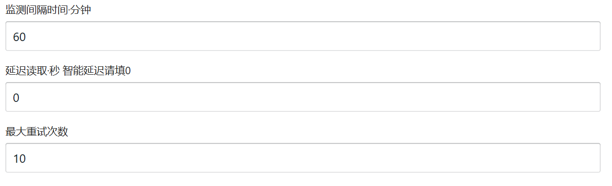
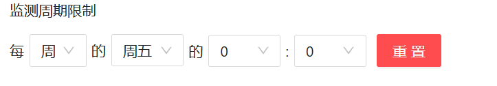
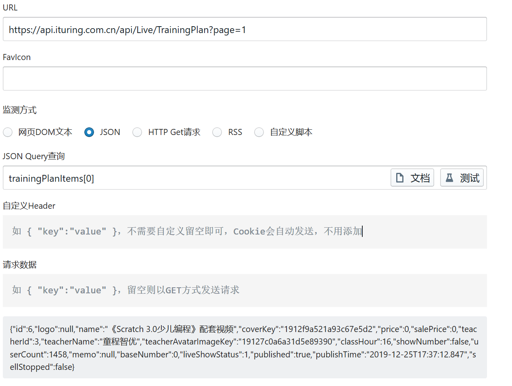

#  Check酱

**Check酱是一个通用网页内容监控工具，可以监测网页内容变化，并发送异动到微信**

### 浏览器插件实现

**模拟真人的浏览器插件**

无需模拟登陆，模拟在后台打开标签页。

#### 安装

商店安装：Edge商店搜索`Check酱`

官网下载Zip包：ckc.ftqq.com

#### 添加任务

1.手动添加

需要具备HTML知识，手写选择器。

2.自动添加

在检测的页面上点击鼠标右键，选择`定位检测对象`，点击要监测的文字区域，工具即可自动添加选择器。



- 监测间隔时间：即每隔多少分钟监测一次。如果是0，则每分钟监测一次，如果是1，则每两分钟监测一次（间隔一分钟）。
- 延迟读取：因为不知道页面需要多久才能加载完成，所以需要进行延迟读取。设置成0即是智能延迟。（如果网页使用假加载，就手动填写延迟读取）
- 最大重试次数：因为某些原因，网页加载可能失败，为了防止一直监测，设置最大重试次数。



监测周期限制：即什么时间开始进行监测。

填入对应Send Key来选择推送的位置。

由于chrome插件第三版禁止了检测脚本(处于安全性)，所以无法检测页面改变而url不改变的页面。

### 高阶教程

#### 多选择器

多个区域发生变化并且要写在同一条规则里，使用多选择器。

逗号分隔，默认取全列表。

使用检查元素进行selector的获取。

#### JSON

使用JSON来监测数据。

之间粘贴进请求的url如：

> https://api.ituring.com.cn/api/Live/TrainingPlan?page=1

使用Json Query来进行选择



#### RSS

使用网站自身提供的RSS进行监测。

#### MQTT物联网

### 关机后运行任务

云端版本：通过后台运行任务，没有界面，难以调试。

**远程桌面版本**：把浏览器和插件直接打包到服务器。

安装docker:

```shell
sudo apt update && sudo apt install docker.io
```

查看docker目录：

```shell
sudo docker ps
```

####  通过 Docker-compose 启动

创建数据目录：

在当前目录创建user_data目录:

```shell
mkdir data && chmod -R 755 data
```

新建一个 `docker-compose.yml` 文件，将下边的内容按提示调整后粘贴保存：

```yml
version: '3'
services:
  chrome:
    image: easychen/checkchan:latest
    volumes:
      - "./data:/checkchan/data"
    environment:
      - "CKC_PASSWD=root"
      - "VDEBUG=OFF"
      - "VNC=ON"
      #- "WIN_WIDTH=414"
      #- "WIN_HEIGHT=896"
      #- "XVFB_WHD=500x896x16"
      - "API_KEY=YSXB114514"
      - "ERROR_IMAGE=NORMAL" # NONE,NORMAL,FULL
      #- "SNAP_URL_BASE=<开启截图在这里写服务器地址（结尾不用加/），不开留空>..."
      #- "SNAP_FULL=1"
      - "TZ=Asia/Chongqing"
      # - "WEBHOOK_URL=http://..." # 云端 Webhook地址，不需要则不用设置
      # - "WEBHOOK_FORMAT=json" # 云端 Webhook POST 编码，默认是 Form
    ports:
      - "5900:5900" 
      - "8080:8080" 
      - "8088:80"
```

保证Docker用户对此目录有写权限，并在同一目录下运行以下命令：

```shell
docker-compose up -d
```

####  通过 Docker 启动

需要取远程仓库拉取镜像

```shell
sudo docker run -d -p 8088:80 -p 8080:8080 -p 5900:5900 -v ${PWD}/data:/checkchan/data -e API_KEY=YSXB114514  -e VDEBUG=OFF -e VNC=ON -e SNAP_URL_BASE=http://localhost:8088  -e CKC_PASSWD=123 -e TZ=Asia/Chongqing easychen/checkchan:latest
```

#### 1. **配置国内镜像加速器**

国内访问 Docker 官方仓库可能会受限，因此使用国内镜像加速器是最常见的解决方案。例如，腾讯云提供了加速服务。

##### 步骤：

1. 编辑 Docker 配置文件：

   ```shell
   sudo nano /etc/docker/daemon.json
   ```

2. 添加镜像加速器配置（以腾讯云为例）：

   ```shell
   {
     "registry-mirrors": ["https://mirror.ccs.tencentyun.com"]
   }
   ```

3. 重启 Docker 服务：

   ```shell
   sudo systemctl daemon-reload
   sudo systemctl restart docker
   ```

##### 放入json文件到test文件夹下

```shell
sudo docker run -d -p 8088:80 -p 8080:8080 -p 5900:5900 -v ${PWD}/data:/checkchan/data -v ${PWD}/test:/checkchan/test -e API_KEY=YSXB114514  -e VDEBUG=OFF -e VNC=ON -e SNAP_URL_BASE=http://localhost:8088  -e CKC_PASSWD=123 -e TZ=Asia/Chongqing easychen/checkchan:latest
```

